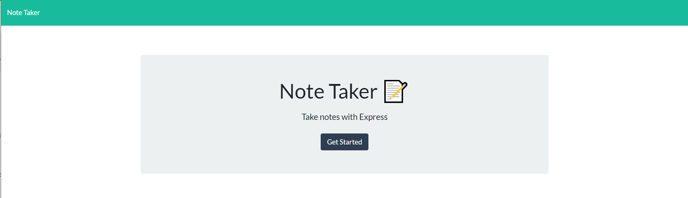
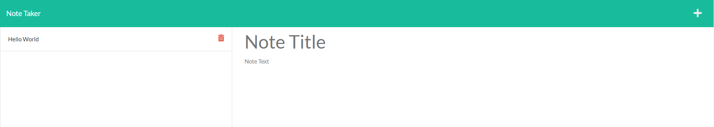

# NoteTaker

## License
MIT 

## Description
This  node.js project allows users to intuitively write down or delete quick notes and reminders. HTML is served using express.js. The backend data store is a local json file.

## Table of Contents
* [Description](#description)
* [License](#license)
* [Installation](#installation)
* [Usage](#usage)
* [License](#license)

## Installation
You will need:
<ul>
<li>Node.js </li>
<li>express.js</li>
<li>uuid.js</li>
<li>Type 'npm start'  to start web server.</li>
</ul>

## Usage
 
 
 A user is shown a landing page to get started.  Once they press the Get Started button then the notes page loads offering them the opportunity to enter notes. 
Type new notes on the right-hand side. 
Press the floppy icon on the upper right. It un-hides itself after you mouseenter the second line of the form.   Use the left hand side as a quick list.  Press the red trashcans on the left to delete that note. 

## Contribute
Contributors may request access via email. Clone the repo. Make a PR.

## Testing
You can use API-route software like PostMan or Insomnia to test routes. Endpoints -  
<ul>
<li>GET  - localhost:3001/api/notes</li>
<li>POST  - localhost:3001/api/notes</li>
<li>DELETE - localhost:3001/api/notes/[id]</li>
<li>The IDs use long UUIDs. It may be better to cut/paste from /data/db.json into the the test endpoint .</li>
</ul>

## Questions
GitHub User Name: phaberle 
Email Address: paulshaberle@gmail.com

### How to reach me with additional questions:
Contributors may contact me through email. I try to check my email often. But it may take a while to receive a reply.
